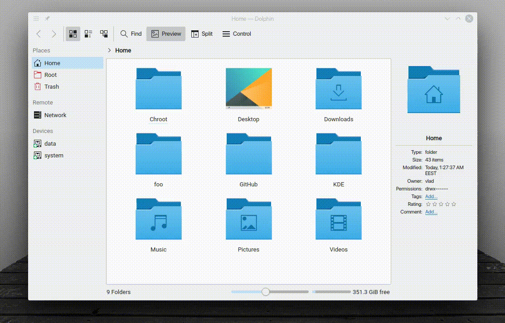

"Disappear 3" is a KWin effect that animates the disappearing of windows.

## Installation

### Arch Linux

For Arch Linux [kwin-effects-disappear3](https://aur.archlinux.org/packages/kwin-effects-disappear3/)
is available in the AUR.

### From source

```sh
git clone https://github.com/zzag/kwin-effects-disappear3.git
cd kwin-effects-disappear3
mkdir build && cd build
cmake ..
make -jN
sudo make install
```
